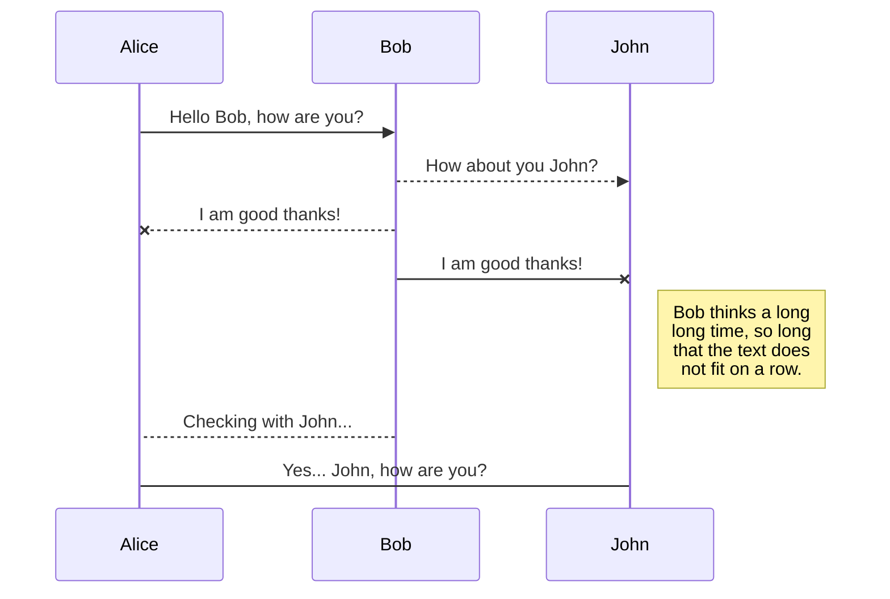
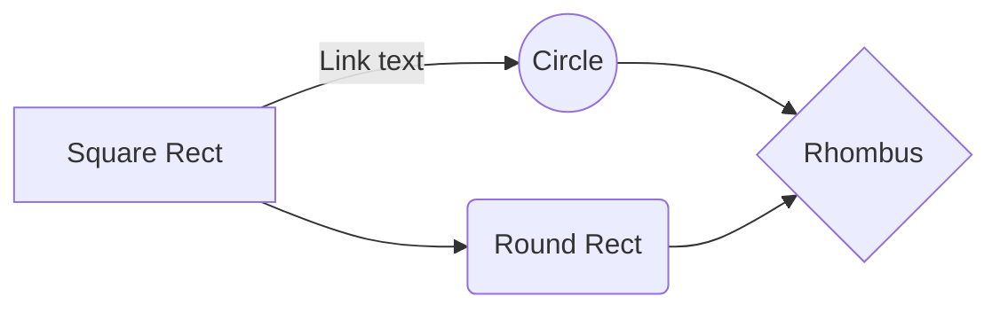

# MessageSimulator
We try to learn hybride, message-orientierte and reactive and the effects of it 


## Running the application locally

Open sample01 with eclipse or intellij. See pom.xml for java
requirements. Make a maven reload.


Steps
1. docker-compose up
2. Start sample-application within intellij


## Documentation

https://drive.google.com/drive/folders/1E3qmszlbwIsQAW5mp99LMlFbxcFYdoH-

## In beginning there was chaos
```text
||||
||||
||||
\||/
 \/
```

- zookeeper = coordination service for distributed applications
- KRaft =  Apache Kafka Raft (KRaft) is the consensus protocol that was introduced in KIP-500 to remove Apache Kafka’s dependency on ZooKeeper for metadata management. 

https://cwiki.apache.org/confluence/display/KAFKA/Compatibility+Matrix

https://docs.spring.io/spring-kafka/reference/quick-tour.html

https://docs.spring.io/spring-kafka/reference/kafka/connecting.html

https://docs.confluent.io/home/overview.html

https://docs.spring.io/spring-kafka/api/org/springframework/kafka/core/package-summary.html

https://kafka.apache.org/quickstart
```bash
docker-compose up -d
docker pull rabbitmq
docker pull apache/activemq-artemis

```

## Microservices for the Win
### Tracing of Messages

https://microservices.io/patterns/observability/distributed-tracing.html

https://zipkin.io/

### Saga pattern for transaction spanning multiple services


#### Chereography
https://docs.axoniq.io/reference-guide/v/3.1/part-ii-domain-logic/sagas

#### Orchestration

https://camel.apache.org/components/4.0.x/eips/saga-eip.html
## Compare API specs/protocols

https://docs.spring.io/spring-boot/docs/current/reference/html/messaging.html#messaging.amqp

- https://www.oracle.com/java/technologies/java-message-service.html

Java Message Service (JMS) vs Advanced Message Queuing Protocol (AMQP)

## Compare Message Broker

Apache ActiveMQ is a great workhorse full of features and nice stuff.
It's not the fastest MQ software around but fast enough for most use
cases. Among features are flexible clustring, fail-over, integrations
with different application servers, security etc.

Apache Apollo is an attempt to write a new core for ActiveMQ to cope
with a large amount of clients and messages. It does not have all nice
and convenient feature of ActiveMQ but scales a lot better. Apache
Apollo is a really fast MQ implementation when you give it a large
multi-core server and thousands of concurrent connections. It has a
nice, simple UI, but is not a "one-size-fits-all" solution.

It seems that there is an attempt ongoing to merge a number of
ActiveMQ features with HornetQ under the name ActiveMQ Artemis.
HornetQ has JMS2.0 support, so my humble guess is that it's likely to
appear in ActiveMQ 6.x.

Kafka is a different beast. It's a very simple message broker intended
to scale persistent publish subscribe (topics) as fast as possible
over multiple servers. For small-medium sized deployments, Kafka is
probably not the best option. It also has it's way to do things to
achieve the high throughput, so you have to trade a lot in terms of
flexibility to get high distributed throughput. If you are new to the
area of MQ and brokers, I guess Kafka is overkill. On the other hand -
if you have a decent sized server cluster and wonder how to push as
many messages as possible through it - give Kafka a spin!


### What about RabbitMQ?

## Apache Arrow

https://www.dremio.com/open-source/apache-arrow/

## Kafka
docker pull bitnami/kafka


https://kafka.apache.org/
https://kafka.apache.org/32/javadoc/index.html
https://hub.docker.com/r/wurstmeister/kafka/


## Message oriented programming with PHP

Framework welches entsprechende Strukturen anbietet:
- https://github.com/ecotoneframework/ecotone

## Kafka ui?

  kafka-ui:
    container_name: kafka-ui
    image: provectuslabs/kafka-ui:latest
    ports:
      - 8080:29093
    environment:
      DYNAMIC_CONFIG_ENABLED: 'true'
    volumes:
      - ~/kui/config.yml:/etc/kafkaui/dynamic_config.yaml


# Message Orientierte Logistik

Im Folgenden soll der Ablauf und die einzelnen Stationen der Logistik der haar-shop.ch aufgelistet werden. Die einzelnen Komponenten werden vereinfacht abgebildet.

## Bestellungen generieren
Ein Generator erzeugt konstant Bestellungen.
Eine Bestellung besteht aus folgenden Eigenschaften:
- Bestellnummer
- Kunde
    - Kundennummer
    - PLZ
    - Geschlecht
    - Kundenstatus
        - Neukunde oder Bestandeskunde
- Positionen
    - Produktnummer
    - Anzahl
- Preis
- Bezahlmethode
    - Kreditkarte, Rechnung oder Twint
- Versandart
    - A-Post oder B-Post
- Teillieferung

Eine generierte Bestellung hat den Status **importiert**.

## Bestellungen prüfen
Importierte Bestellungen werden dann auf Sonderheiten geprüft.

### Export
Bestellungen aus einem bestimmten Nummernkreis, sollen in einer separaten Tabelle erfasst und für den weiteren Versand gesperrt werden.
> Hintergrund: haar-shop.ch liefert grundsätzlich nur in die Schweiz. Jedoch gibt es in der Schweiz mit der Gemeinde Samnaun ein Zollausschlussgebiet. Bestellungen aus Samnaun müssen also als Exporte behandelt werden und entsprechende Dokumente beigelegt werden.

### Betrugsversuch
Es kommt immer wieder vor, dass es unter den Kunden Betrüger hat. Die folgenden Kriterien deuten auf Betrug hin und die Bestellungen werden dann entsprechend markiert und gegen Signatur versendet.
- Kundentyp: Neukunde
- Bezahlmethode: Rechnung
- Preis: >= CHF 100

## Kommissionslisten erstellen
Die Produkte aus Bestellungen, welche komplett kommissionierbar sind, sollen in Kommissionslisten erfasst werden.

## Kommissionierung simulieren
Die Abarbeitung der Kommissionierungslisten soll simuliert werden. Wurden alle Bestellpositionen einer sich auf einer Kommissionierungsliste befindenden Bestellung kommissioniert, gilt die Bestellung als **verpackungsbereit**.

## Teillieferungen aktivieren
haar-shop.ch ist bestrebt, alle Bestellungen so schnell wie möglich zur Kund*in zu bringen. Gleichzeitig soll eine Bestellung möglichst komplett ausgeliefert werden. Sollte für eine Bestellung nicht alle Bestellpositionen verfügbar sein, wird die Verarbeitung so lange wie möglich herausgezögert, in der Hoffnung, dass die fehlenden Produkte im Verlauf des Tages noch angeliefert werden. Ab 17:00 wird auf allen pendenten Bestellungen die Teillieferung aktiviert.

## Lagerbestände führen
Normalerweise werden die Lagerbestände von dem Logistiksystem


## SmartyPants

SmartyPants converts ASCII punctuation characters into "smart" typographic punctuation HTML entities. For example:

|                |ASCII                          |HTML                         |
|----------------|-------------------------------|-----------------------------|
|Single backticks|`'Isn't this fun?'`            |'Isn't this fun?'            |
|Quotes          |`"Isn't this fun?"`            |"Isn't this fun?"            |
|Dashes          |`-- is en-dash, --- is em-dash`|-- is en-dash, --- is em-dash|


## UML diagrams

You can render UML diagrams using [Mermaid](https://mermaidjs.github.io/). For example, this will produce a sequence diagram:



And this will produce a flow chart:


